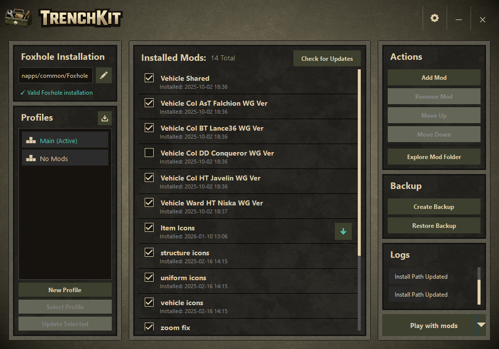

<p align="center">
    
</p>

<p align="center">
    <a href="https://github.com/Tapawingo/TrenchKit/releases"></a>
    <a></a>
    <a href="https://github.com/Tapawingo/TrenchKit/issues" alt="Issue Tracker"></a>
    <a href="https://github.com/Tapawingo/TrenchKit/blob/master/LICENSE.md"></a>
</p>

<p align="center">
    <strong>A small mod manager for Foxhole.</strong><br/>
    <sup>Not affiliated with Siege Camp / Foxhole. This is a community tool.</sup>
</p>

<p align="center">
  
</p>

## Quick Start
1. Download the latest release from the [Releases page](https://github.com/Tapawingo/TrenchKit/releases)
2. Extract and run `TrenchKit.exe`
3. Select your Foxhole install directory
4. Add mods and enable them with one click

## Features
- List installed mods
- Install mods from `.pak` or `.zip`
- Enable / disable mods by the click of a button
- Save / export / import / share "profiles" of enabled / disabled mods
- Create / restore game backups
- Launch game with or without mods
- Install mod from Nexusmods
- Install mod from Itch.io
- Check for mod updates
- Check for mod conflicts
- Check for mod dependencies (requires mod manifest)

## Usage Guide

### Load Order

When multiple mods are enabled, their **load order** determines which mod "wins" when two mods modify the same game file. TrenchKit assigns each enabled mod a numbered filename (e.g. `001_modname.pak`, `002_othermod.pak`) that controls the order Foxhole loads them.

**Key concept:** Mods loaded *later* overwrite mods loaded *earlier*. This means the mod at the **bottom** of the list has the **highest priority**. Its files take precedence over everything above it.

To change load order, **drag and drop** mods in the list to reorder them. You can also use the **Mod Conflict** button to see which mods share files and may need reordering.

### Installing Mods from NexusMods or Itch.io

1. Click the **"Add Mod"** button
2. Select **"Download from NexusMods"** or **"Download from Itch.io"**
3. Authenticate with the platform (see Authentication section below)
4. Enter the mod URL and follow the prompts

**Why download through TrenchKit?** Mods downloaded using the Add Mod button automatically store metadata (mod ID, file ID, and source information) which enables the **Check for Updates** feature.

### Checking for Mod Updates

Click the **"Check for Updates"** button to see if newer versions are available for your installed mods.

**Important:** The update checker only works for mods that have source metadata. This means:
- ✅ Mods downloaded through the Add Mod button (NexusMods/Itch.io)
- ✅ Manually installed mods with metadata added via "Edit Metadata" (right-click mod)
- ❌ Manually installed `.pak` files without metadata

To enable updates for manually installed mods, right-click the mod and select **"Edit Metadata"** to add the NexusMods or Itch.io information.

## For Mod Makers

Are you creating mods for Foxhole? Check out [MODMAKER.md](MODMAKER.md) for detailed guidance on:
- How TrenchKit detects mod updates
- Best practices for version numbering and file naming
- Platform-specific recommendations (Nexus Mods vs Itch.io)
- Edge cases and troubleshooting
- Testing your integration with TrenchKit

This guide helps ensure your users get a smooth update experience!

### Authentication

#### NexusMods (SSO)
TrenchKit uses NexusMods Single Sign-On (SSO) authentication:
1. Go to **Settings** → **NexusMods Integration**
2. Click **"Authenticate (SSO)"**
3. Your browser will open to the NexusMods authorization page
4. Click **"Authorize"** to grant TrenchKit access
5. The authentication will complete automatically

#### Itch.io (API Key)
To download mods from Itch.io, you need an API key:

1. Visit [itch.io API Keys page](https://itch.io/user/settings/api-keys)
2. Click **"Generate new API key"**
3. Copy the generated key
4. In TrenchKit, go to **Settings** → **Itch.io Integration**
5. Click **"Add API Key"** and paste your key

**Note:** Keep your API key private. It grants access to your itch.io account.

## Goals
- Make enabling/disabling mods simple
- Streamline mod installation and updates
- Keep changes transparent
- Be safe by default (backups, restore)

## Build (Ninja)

### Requirements
- A C++20 compiler toolchain
- CMake 3.24+
- Ninja
- Qt 6.5+
- Platform-specific TLS libraries:
  - **Windows**: Built-in (Schannel)
  - **Linux**: OpenSSL 1.1.x or 3.x (`libssl-dev` on Debian/Ubuntu, `openssl-devel` on Fedora/RHEL)
  - **macOS**: Built-in (SecureTransport)

### 1) Install dependencies
- Install **Qt 6** (development files + CMake config packages)
- Install **Ninja**
- Install a C++ compiler (MSVC, clang, or gcc)
- **Linux only**: Install OpenSSL development libraries

### 2) Configure (Debug)
```sh
cmake -S . -B build/debug -G Ninja -DCMAKE_BUILD_TYPE=Debug
```

### 3) Build
```sh
cmake --build build/debug
```

### 4) Configure (Release)
```sh
cmake -S . -B build/release -G Ninja -DCMAKE_BUILD_TYPE=Release
```

### 5) Build
```sh
cmake --build build/release
```

## If CMake can’t find Qt
Provide a hint to your Qt installation.

### Option A: `CMAKE_PREFIX_PATH`
```sh
cmake -S . -B build/debug -G Ninja -DCMAKE_BUILD_TYPE=Debug \
  -DCMAKE_PREFIX_PATH="</path/to/Qt>"
```

### Option B: `Qt6_DIR`
```sh
cmake -S . -B build/debug -G Ninja -DCMAKE_BUILD_TYPE=Debug \
  -DQt6_DIR="</path/to/Qt>/lib/cmake/Qt6"
```

### Option C: vcpkg toolchain
```sh
cmake -S . -B build/debug -G Ninja -DCMAKE_BUILD_TYPE=Debug \
  -DCMAKE_TOOLCHAIN_FILE="</path/to/vcpkg>/scripts/buildsystems/vcpkg.cmake"
```

## Running
Run the produced executable from the build output directory.

If you want to run the app outside your build environment, you may need to deploy Qt runtime libraries.
On some platforms this is handled automatically by your packaging system; on others you’ll use Qt’s deployment tools.

## Mod Safety & Disclaimer
- TrenchKit does **not** modify game files directly without your consent
- Backups are created before any destructive operation
- Mods are loaded at your own risk
- This tool does **not** bypass anti-cheat or DRM

Use mods responsibly and in accordance with Foxhole’s terms of service.

## License
**TrenchKit** is licensed under the MIT License ([MIT](LICENSE.md))

## Contributing
See [`CONTRIBUTING.md`](CONTRIBUTING.md).

## Acknowledgements
Foxhole is a trademark of its respective owners.
